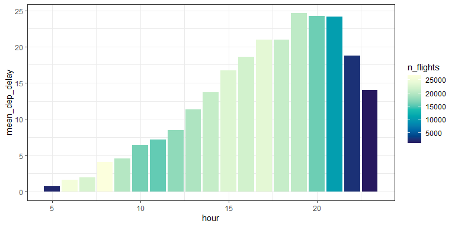
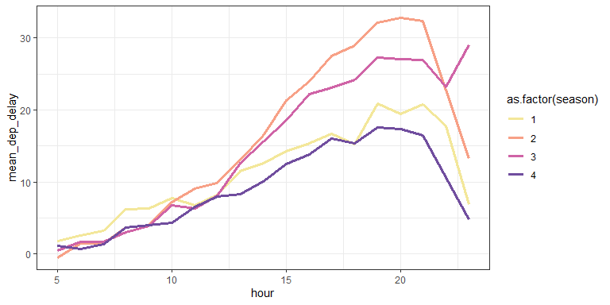
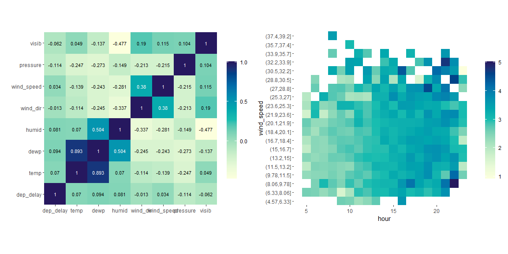

Flight Delay Analysis
================
Xinkai Shen
10/12/2022

# Summary

After calculating and analyzing the dataset, we analyze some factors
that affect the flight delay time so that we can choose the right time
to travel; since the arrival delay is generally affected by the
departure delay time, we mainly analyze here which decision to travel
using can minimize the departure delay time.

- First, we found that the time of day has the most obvious impact on
  departure delay time, the average value of departure delay time is the
  lowest at 5:00 am, and then it will gradually increase until it
  reaches the peak around 8:00 pm, and then gradually decrease, we can
  try to avoid the peak of delay time, and try to choose an earlier time
  to travel.

- Second, the season of travel also has a significant impact on the
  delay time of aircraft departure, the average delay time in the fourth
  season is the lowest, the average delay time in the second season is
  the longest, within each season, the delay time with the time of the
  same pattern and the previous analysis.

- After that, we tried to analyze the effect of weather conditions on
  delay times, but we did not find a significant effect of these factors
  on departure delays.

# Specific Analysis

## Overall

We first focus on the relationship between travel time and average
aircraft delays during the day as a whole, so we plot a bar chart of the
average aircraft delays for each hour of the day, while the color of the
bar chart represents the number of flights that departed during the
hour.

``` r
flights %>%
  na.omit() %>%
  mutate(
    date = ymd(str_c(year, '-', month, '-', day)),
    season = (month-1) %/% 3 + 1,
    time_hour_min = ymd_hm(
      str_c(year, '-', month, '-', day, '-', hour, '-', minute)
    )
  ) -> tidy_flights

tidy_flights %>%
  group_by(hour) %>%
  summarise(
    mean_dep_delay = mean(dep_delay, na.rm=TRUE),
    n_flights = n()
  ) %>%
  arrange(hour) %>%
  ggplot() +
  geom_col(aes(x=hour, y=mean_dep_delay, fill=n_flights)) +
  scale_fill_continuous_sequential(palette = "YlGnBu", rev = FALSE) +
  theme_bw()
```



Notice that there is a clear trend in airplane delays over time, with
the basic trend being that the earlier you travel, the shorter the
airplane delay. And there are a lot of flights in the morning, so you
don’t have to worry about not being able to buy tickets if you choose to
travel in the morning.

## Season

Focusing on the impact of seasons on average airplane delays, we plot
the change of airplane delays with time under different seasons, we can
see that there is a significant difference in airplane delays between
different seasons, basically in any time period, the delays in the
fourth season are the smallest, if you need to travel in the afternoon
or night, you can choose the autumn and winter seasons to reduce the
average delay time.

``` r
tidy_flights %>%
  group_by(season, hour) %>%
  summarise(
    mean_dep_delay = mean(dep_delay, na.rm=TRUE),
    n_flights = n()
  ) %>%
  ggplot() +
  geom_line(aes(x=hour, y=mean_dep_delay, color=as.factor(season)), size=1.3) +
  scale_color_discrete_sequential(palette = "Sunset") +
  theme_bw()
```



## Weather

We have the impression that weather should have a significant effect on
aircraft delays, and here we plot the matrix heat map of correlation
coefficients between all weather factors and aircraft delays, but we
find that all variables have very low correlation coefficients with
delays, and we can assume that there is no significant linear
relationship between these variables and aircraft delays.

``` r
flights %>%
  dplyr::select(origin, year, month, day, hour, dep_delay) %>%
  left_join(weather, by = c("origin", "year", "month", "day", "hour")) %>%
  select(dep_delay, temp, dewp, humid, wind_dir, wind_speed, pressure, visib) %>%
  na.omit() %>%
  cor() %>%
  as.data.frame() %>%
  rownames_to_column(var="var") %>%
  melt() %>%
  mutate_if(is.character, as_factor) %>%
  mutate(text_color=if_else(value > 0.2, "white","black")) %>%
  ggplot(aes(x=var, y=variable)) +
  geom_tile(aes(fill=value)) +
  geom_text(
    aes(label=round(value, 3), color=text_color), 
    show.legend = F,
    size=3
  ) +
  scale_fill_continuous_sequential("YlGnBu") +
  labs(x="", y="") +
  coord_fixed() +
  scale_color_manual(values=c("black","white")) +
  scale_y_discrete(expand = c(0,0)) + 
  scale_x_discrete(expand = c(0,0)) +
  theme_heat -> p1

weather %>%
  na.omit() %>%
  mutate(
    wind_speed = cut(wind_speed, breaks=20)
  ) %>%
  right_join(
    flights %>%
      dplyr::select(origin, year, month, day, hour, dep_delay),
    by = c("origin", "year", "month", "day", "hour")
  ) %>%
  group_by(hour, wind_speed) %>%
  summarise(
    mean_dep_delay = log(mean(dep_delay, na.rm=TRUE) + 10),
    n_flights = n()
  ) %>%
  na.omit() %>%
  ggplot() +
  geom_tile(aes(x=hour, y=wind_speed, fill=mean_dep_delay)) +
  scale_fill_continuous_sequential("YlGnBu") +
  scale_y_discrete(expand = c(0,0)) + 
  coord_fixed() + 
  theme_heat -> p2
cowplot::plot_grid(p1, p2)
```



Continuing to plot the changes in the average delay time of aircraft at
different wind speeds during the day, the pattern from the horizontal
direction is basically the same as previously observed, i.e., the
average delay time gradually increases as the time gets later; from the
vertical direction, there seems to be no obvious pattern, in a step that
confirms the conclusion that there is no relationship between wind speed
and delay time.
